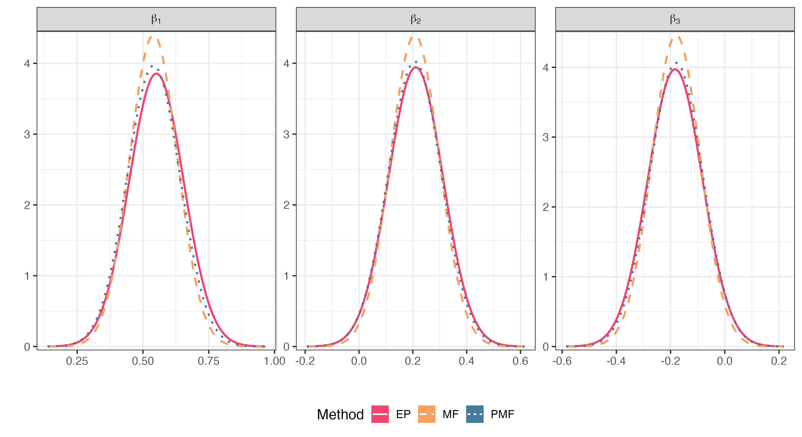

viord: Brazilian Bank Case Study
================
Emanuele Aliverti

This document provides an illustration of the `viord` package,
replicating analysis on the “Brazilian Bank” dataset produced in Section
4.1 of Aliverti (2025); data are provided from Azzalini and Scarpa
(2012), and furhter details can be found in Appendix B.3 of such a
reference. We fit an ordered probit model using the three different
variational algorithms available in the package: Expectation Propagation
(EP), Mean-Field (MF) Variational Bayes, and Partially-Factorized
Mean-Field (PMF).

------------------------------------------------------------------------

First, we load the `viord` package, or install it if not present.

``` r
#devtools::install_github("https://github.com/emanuelealiverti/EPCP", subdir = 'viord')
library(viord)
```

## Data Loading and Preparation

We load the Brazilian bank dataset directly from its source URL. The
data contains customer `satisfaction` ratings and several predictors.

``` r
# Brazilian bank data
brazil = read.csv("http://azzalini.stat.unipd.it/Libro-DM/brazil.csv")
```

Next, we prepare the response variable `Yt` and the design matrix `X`.

1.  The response `Yt` is created by converting the `satisfaction` column
    to an ordered factor.
2.  The design matrix `X` is created by standardizing the predictors
    (`age`, `gender`, `pincome`) as recommended by Gelman (2008)

``` r
# Define the ordered categorical response
Yt = factor(brazil$satisfaction, ordered = TRUE)
X = model.matrix(~age + gender + pincome, data = brazil)[,-1]
X = apply(X,2, function(l)  (l - mean(l))/(2 * sd(l)))
```

We specify the list of prior parameters (mean vector and covariance
matrices) required by the `viord` function, and the precision `Q0` ans
the inverse of the covariance.

``` r
p = NCOL(X)
prior = list(mu0 = rep(0, p), S0 = diag(2, p, p))
prior$Q0 = solve(prior$S0)
```

## Posterior inference

We can now fit the model using the different algorithms available in the
package.

#### Expectation Propagation (EP)

Here, we run the EP approximation (`algorithm = "EP"`). With this
method, the thresholds are estimated by maximizing the (approximate)
log-marginal likelihood; the algorithm is described in Section 2.4 and
Algorithm 3 of Aliverti (2025).

``` r
# Run the EP algorithm
ep_tmp = viord(Y = Yt, X = X, prior = prior, algorithm = "EP")
summary(ep_tmp)
```

    ## 
    ## Summary of VI Ordinal Model
    ## Inference algorithm: EP 
    ## 
    ## Posterior estimates:
    ##            Estimate Std. Error
    ## age         0.5512   0.1035   
    ## genderMale  0.2109   0.1012   
    ## pincome    -0.1832   0.1004   
    ## 
    ## Threshold parameters (cutpoints):
    ##          Estimate
    ## alpha[1] -1.1895 
    ## alpha[2] -0.7600 
    ## alpha[3]  0.0657 
    ## 
    ## Converged in 5 iterations. Approx. log marginal likelihood: -600.2

#### Mean-Field Variational Bayes

Next, we run the standard Mean-Field (MF) variational approximation
(`algorithm = "MF"`) described in Section 2.2 and Algorithm 1 of
Aliverti (2025). With this method, the thresholds are estimated by
maximizing the Evidence Lower Bound (ELBO).

``` r
# Run the MF (VB) algorithm
vb_tmp = viord(Y = Yt, X = X, prior = prior, algorithm = "MF")
summary(vb_tmp)
```

    ## 
    ## Summary of VI Ordinal Model
    ## Inference algorithm: MF 
    ## 
    ## Posterior estimates:
    ##            Estimate Std. Error
    ## age         0.5401   0.0907   
    ## genderMale  0.2073   0.0907   
    ## pincome    -0.1795   0.0894   
    ## 
    ## Threshold parameters (cutpoints):
    ##          Estimate
    ## alpha[1] -1.1359 
    ## alpha[2] -0.7192 
    ## alpha[3]  0.0702 
    ## 
    ## Converged in 11 iterations. Approx. log marginal likelihood: -589.2

------------------------------------------------------------------------

#### Partially Factorized Mean-Field Variational Bayes

Finally, we run the Partially-Factorized Mean-Field (PMF) approximation
(`algorithm = "PMF"`), which also estimates thresholds by maximizing the
ELBO; this routine is outlined in Section 2.3 and Algorithm 3 of
Aliverti (2025).

``` r
# Run the PMF algorithm
pmf_tmp = viord(Y = Yt, X = X, prior = prior, algorithm = "PMF")
summary(pmf_tmp)
```

    ## 
    ## Summary of VI Ordinal Model
    ## Inference algorithm: PMF 
    ## 
    ## Posterior estimates:
    ##            Estimate Std. Error
    ## age         0.5405   0.1005   
    ## genderMale  0.2073   0.0992   
    ## pincome    -0.1794   0.0982   
    ## 
    ## Threshold parameters (cutpoints):
    ##          Estimate
    ## alpha[1] -1.1359 
    ## alpha[2] -0.7192 
    ## alpha[3]  0.0702 
    ## 
    ## Converged in 6 iterations. Approx. log marginal likelihood: -590.4

## Graphical comparison

We compare the three approximations graphically. Note that for `PMF`,
the marginal posterior for $\beta$ is **not** Gaussian, and should be
avaluated relying on the utility `simulate` that creates independent
Monte-Carlo samples from the approximate posterior. For simplicity, we
display such a density as a Gaussian whose moments match those of the
approximate density $q^\star_{\small PMF}(\beta_j)$

``` r
# Not run
pmf_sim = simulate(pmf_tmp,Yt,X, prior)
```

``` r
library(ggplot2)
pmeans = list("EP" = ep_tmp$est$m, "MF" = vb_tmp$est$m, "PMF" = pmf_tmp$est$m) 
pvar = list("EP" = ep_tmp$est$S, "MF" = vb_tmp$est$S, "PMF" = pmf_tmp$est$S) 
plot_marginals(m_list = pmeans, S_list = pvar, methods_labels = names(pmeans))
```



# References

<div id="refs" class="references csl-bib-body hanging-indent">

<div id="ref-main" class="csl-entry">

Aliverti, Emanuele. 2025. “Approximate Bayesian Inference for Cumulative
Probit Regression Models.” *arXiv Preprint arXiv:*

</div>

<div id="ref-scarpa:2012" class="csl-entry">

Azzalini, Adelchi, and Bruno Scarpa. 2012. *Data Analysis and Data
Mining: An Introduction*. OUP USA.

</div>

<div id="ref-gelman:2008" class="csl-entry">

Gelman, Andrew. 2008. “Scaling Regression Inputs by Dividing by Two
Standard Deviations.” *Statistics in Medicine* 27 (15): 2865–73.

</div>

</div>
