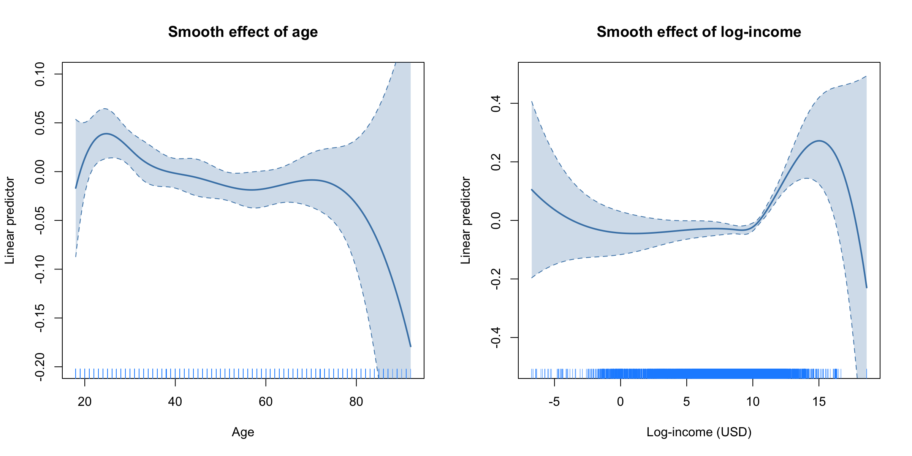
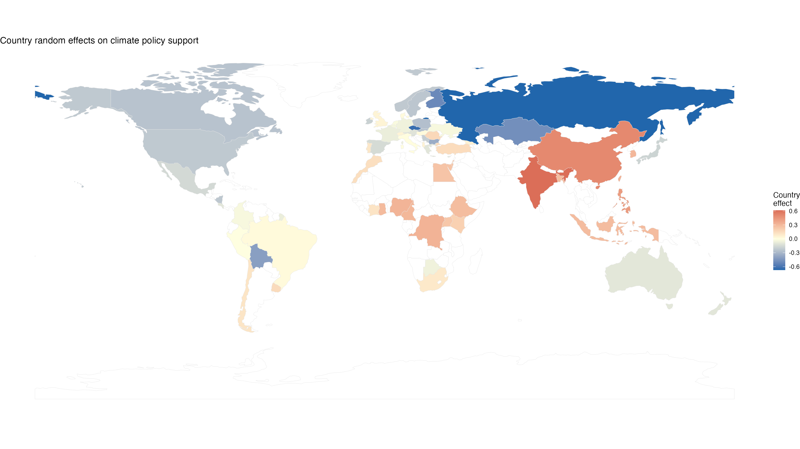

viord: Climate Policy Support Case Study
================
Emanuele Aliverti

This document illustrates the mixed-effects extension of the `viord`
package, using the TISP dataset (Mede and Cologna, 2023) — an
international survey on public attitudes towards climate change
collected across 66 countries. We model ordinal support for climate
policies (`CLIM_POLSUPPORT`) as a function of demographic predictors,
with nonlinear effects of age and log-income represented via B-splines
and country-level random intercepts capturing cross-national
heterogeneity. Inference uses the `"VB_prior"` algorithm, which places
an inverse-gamma prior on the coefficient variance and jointly estimates
its scale from the data.

------------------------------------------------------------------------

First, we load the required packages.

``` r
library(viord)
library(splines)
```

## Data Loading

We download the data directly from the OSF repository of Mede and
Cologna (2023). The dataset is stored in a semicolon-separated CSV file
with European decimal notation, so we use `read.csv2` after downloading.

``` r
url_data <- "https://osf.io/download/xjc4p"
tmp_file <- tempfile(fileext = ".csv")
curl::curl_download(url_data, tmp_file)
dd <- read.csv2(tmp_file)
unlink(tmp_file)
```

    ## Dataset dimensions: 69534 x 141

## Response Variable

Five items (`CLIM_POLSUPPORT_*`) measure support for specific climate
policies (fuel taxes, public transport, sustainable energy, environmental
protection, food taxes) on a 1–3 ordinal scale. Value 4 ("Not
applicable") is treated as missing following the codebook. We sum the
five items and discretise into `K = 5` ordered categories.

``` r
risp <- grep("CLIM_POLSUPPORT", names(dd), value = TRUE)
for (v in risp) dd[[v]][dd[[v]] == 4] <- NA
dd$y_sum <- rowSums(dd[, risp])
K <- 5
Yt <- cut(dd$y_sum, breaks = K, include.lowest = TRUE)
table(Yt, useNA = "always")
```

    ## Yt
    ## [4.99,7]    (7,9]   (9,11]  (11,13]  (13,15]     <NA> 
    ##     1476     4308    15574    22178    13017    12981

## Covariate Preparation

We retain demographic predictors: age, log-income, gender, education,
political orientation, religiosity, and urban/rural residence. After
listwise deletion of incomplete cases the analysis sample has 41,976
individuals from 66 countries.

``` r
vars_keep <- c("DEM_AGE", "DEM_INCOME_USD_log",
               "COUNTRY_CODE",
               "DEM_GENDER_male",
               "DEM_EDU",
               "DEM_POL_right",
               "DEM_RELIGIOUS",
               "DEM_RESIDENCE")
df <- dd[, vars_keep]
df$Yt <- Yt
df <- na.omit(df)
cat("Sample size after listwise deletion:", nrow(df), "\n")
```

    ## Sample size after listwise deletion: 41976

## Nonlinear Effects via B-Splines

Age and log-income enter the linear predictor through centred cubic
B-spline bases with `df = 6` basis functions each (four internal knots
placed at quantiles). Centring the columns ensures that each smooth has
zero mean over the observed data, which is required for identifiability
in additive models whose intercept is absorbed by the ordinal thresholds.

``` r
ndf <- 6
age    <- df$DEM_AGE
income <- df$DEM_INCOME_USD_log

B_age_raw    <- bs(age,    df = ndf, intercept = FALSE)
B_income_raw <- bs(income, df = ndf, intercept = FALSE)

B_age    <- sweep(B_age_raw,    2, colMeans(B_age_raw))
B_income <- sweep(B_income_raw, 2, colMeans(B_income_raw))
```

Prediction grids and corresponding spline bases (using the same training
column means) are prepared for plotting.

``` r
age_grid    <- seq(min(age),    max(age),    length.out = 200)
income_grid <- seq(min(income), max(income), length.out = 200)

Bn_age    <- sweep(predict(B_age_raw,    age_grid),    2, colMeans(B_age_raw))
Bn_income <- sweep(predict(B_income_raw, income_grid), 2, colMeans(B_income_raw))
```

## Fixed-Effects Design Matrix

The remaining predictors (gender, education, political orientation,
religiosity, residence) are included as linear fixed effects. No
intercept is included; the ordinal thresholds play its role.

``` r
X_other <- model.matrix(~ DEM_GENDER_male + DEM_EDU + DEM_POL_right +
                           DEM_RELIGIOUS + DEM_RESIDENCE,
                         data = df)[, -1]

X <- cbind(B_age, B_income, X_other)
colnames(X) <- c(paste0("age_bs",  1:ndf),
                 paste0("inc_bs",  1:ndf),
                 colnames(X_other))
```

    ## Fixed-effects design matrix dim: 41976 17

## Random Effects for Country

Country-level random intercepts are encoded via a sum-to-zero contrast
matrix. With 66 countries we obtain 65 columns in `Z_country`; the
omitted country's effect is recovered post-hoc as the negative sum of
the other 65. All columns share a single variance component
(`Z_group = rep(0, ...)`).

``` r
country   <- factor(df$COUNTRY_CODE)
nc        <- nlevels(country)
Z_country <- model.matrix(~ country,
                           contrasts.arg = list(country = contr.sum(nc)))[, -1]
```

    ## Z_country dim: 41976 65  ( 65 cols; last country implicit)

## Model Fitting

We specify an inverse-gamma prior on the fixed-effect coefficient
variance (`a0 = 1, b0 = 2`) and on the country random-effect variance
(`au0 = 1, bu0 = 1`), and fit the model with `algorithm = "VB_prior"`.

``` r
p     <- ncol(X)
prior <- list(mu0 = rep(0, p), a0 = 1, b0 = 2, au0 = 1, bu0 = 1)

fit <- viord(Y       = df$Yt,
             X       = X,
             Z       = Z_country,
             Z_group = rep(0, ncol(Z_country)),
             prior   = prior,
             algorithm = "VB_prior")

summary(fit)
```

    ## 
    ## Summary of VI Ordinal Model
    ## Inference algorithm: VB_prior 
    ## 
    ## Posterior estimates:
    ##                 Estimate Std. Error
    ## age_bs1          0.0885   0.0621   
    ## age_bs2          0.0160   0.0395   
    ## age_bs3          0.0156   0.0460   
    ## age_bs4         -0.0269   0.0519   
    ## age_bs5          0.0678   0.0904   
    ## age_bs6         -0.1623   0.1787   
    ## inc_bs1         -0.2423   0.2375   
    ## inc_bs2         -0.0992   0.1492   
    ## inc_bs3         -0.1444   0.1557   
    ## inc_bs4          0.0461   0.1590   
    ## inc_bs5          0.4910   0.2614   
    ## inc_bs6         -0.3344   0.3742   
    ## DEM_GENDER_male -0.0025   0.0098   
    ## DEM_EDU          0.1321   0.0051   
    ## DEM_POL_right   -0.1818   0.0046   
    ## DEM_RELIGIOUS    0.0161   0.0040   
    ## DEM_RESIDENCE    0.1470   0.0116   
    ## 
    ## Threshold parameters (cutpoints):
    ##          Estimate
    ## alpha[1] -1.9904 
    ## alpha[2] -1.3209 
    ## alpha[3] -0.3883 
    ## alpha[4]  0.6647 
    ## 
    ## Fixed-effect variance sigma_b2 posterior:
    ##          a      b      Mean   E[1/sigma2]
    ## sigma_b2 9.5000 2.4720 0.2908 3.8431     
    ## 
    ## Random-effect variance posterior:
    ##             a       b       Mean    E[1/sigma2]
    ## sigma_u2[0] 33.5000  3.2379  0.0996 10.3462    
    ## 
    ## Converged in 8 iterations. Approx. log marginal likelihood: -54531

The `summary` output reports the posterior mean and standard deviation
for each coefficient, the estimated ordinal thresholds, and the
approximate posterior of the variance parameters. Education, political
orientation (right-leaning), and urban residence have the largest and
most precisely estimated linear effects. The estimated country-level
variance (posterior mean ≈ 0.10) is modest but non-negligible.

## Smooth Effects of Age and Log-Income

We recover the posterior mean and pointwise 95% credible intervals for
each smooth by propagating uncertainty through the B-spline basis using
the posterior covariance `vcov(fit)`.

``` r
beta_hat <- coef(fit)
Vb       <- vcov(fit)

idx_age    <- 1:ndf
idx_income <- (ndf + 1):(2 * ndf)

f_age    <- Bn_age    %*% beta_hat[idx_age]
f_income <- Bn_income %*% beta_hat[idx_income]

se_age    <- rowSums((Bn_age    %*% Vb[idx_age,    idx_age])    * Bn_age)^.5
se_income <- rowSums((Bn_income %*% Vb[idx_income, idx_income]) * Bn_income)^.5

z95 <- qnorm(0.975)

plot_smooth <- function(grid, f, se, xlab, main, rug_x, yl0 = NULL) {
  lwr <- f - z95 * se
  upr <- f + z95 * se
  yl  <- range(lwr, upr)
  if (!is.null(yl0)) yl <- yl0
  plot(grid, f, type = "n", ylim = yl,
       xlab = xlab, ylab = "Linear predictor", main = main)
  polygon(c(grid, rev(grid)), c(upr, rev(lwr)),
          col = adjustcolor("steelblue", alpha.f = 0.25), border = NA)
  lines(grid, f,   col = "steelblue", lwd = 2)
  lines(grid, lwr, col = "steelblue", lwd = 1, lty = 2)
  lines(grid, upr, col = "steelblue", lwd = 1, lty = 2)
  rug(rug_x, col = "dodgerblue")
}

par(mfrow = c(1, 2))
plot_smooth(age_grid,    f_age,    se_age,
            xlab = "Age",              main = "Smooth effect of age",
            rug_x = age,    yl0 = c(-0.2, 0.1))
plot_smooth(income_grid, f_income, se_income,
            xlab = "Log-income (USD)", main = "Smooth effect of log-income",
            rug_x = income, yl0 = c(-0.5, 0.5))
par(mfrow = c(1, 1))
```



The smooth effect of age is relatively flat across most of the range,
with a slight positive trend through mid-life and a drop at the oldest
ages. The smooth effect of log-income shows a non-monotone pattern, with
higher support at intermediate income levels; wide credible intervals at
the extremes of the income distribution reflect limited data there.

## Country Random Effects

We extract the posterior means of the 65 explicit country effects and
recover the reference country's effect as minus their sum (the sum-to-zero
constraint). We then map the effects onto a world map.

``` r
library(ggplot2)
library(sf)
library(spData)
library(maps)

u_hat  <- fit$est$m_u
u_all  <- c(u_hat, -sum(u_hat))

country_levels  <- levels(country)
country_effects <- data.frame(COUNTRY_CODE = country_levels,
                              effect       = as.numeric(u_all))

iso_bridge      <- maps::iso3166[, c("a3", "a2")]
country_effects <- merge(country_effects, iso_bridge,
                         by.x = "COUNTRY_CODE", by.y = "a3", all.x = TRUE)

world_sf <- merge(world, country_effects, by.x = "iso_a2", by.y = "a2", all.x = TRUE)

ggplot(world_sf) +
  geom_sf(aes(fill = effect), color = "gray80", linewidth = 0.15) +
  scale_fill_gradient2(low = "#2166ac", mid = "lightyellow", high = "#d6604d",
                       midpoint = 0, na.value = "gray92",
                       name = "Country\neffect") +
  theme_minimal() +
  theme(panel.grid    = element_blank(),
        axis.text     = element_blank(),
        axis.ticks    = element_blank(),
        panel.background = element_rect(fill = "#ddeeff", color = NA)) +
  labs(title = "Country random effects on climate policy support")
```



Countries shown in blue have higher-than-average climate policy support
after conditioning on individual-level demographics; red countries have
lower-than-average support. The range of country effects is
approximately (−0.67, 0.61), indicating meaningful cross-national
variation that would be ignored by a fixed-effects-only model.

# References

<div id="refs" class="references csl-bib-body hanging-indent">

<div id="ref-main" class="csl-entry">

Aliverti, Emanuele. 2025. "Approximate Bayesian Inference for Cumulative
Probit Regression Models." *arXiv Preprint arXiv:*

</div>

<div id="ref-tisp" class="csl-entry">

Mede, Niels G., and Viktoria Cologna. 2023. "The TISP Dataset." OSF.
https://doi.org/10.17605/OSF.IO/5C3QD

</div>

</div>
